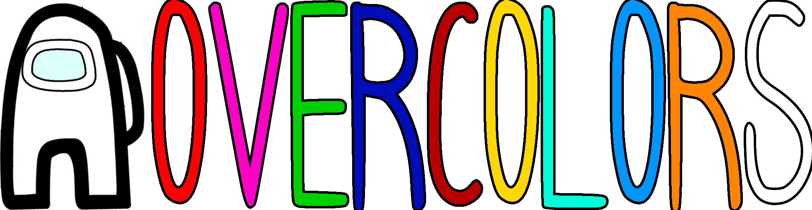

# OverColors
A Among Us mod which adds 60+ Colors for Among Us!
> This mod is not affiliated with Among Us or Innersloth LLC, and the content contained therein is not endorsed or otherwise sponsored by Innersloth LLC. Portions of the materials contained herein are property of Innersloth LLC. © Innersloth LLC.

  
 _NOTE: THIS MOD IS INCOMPABILE WITH [COLORS OF JOY](https://github.com/WanderingPix/Colors-Of-Jo)_
  
## Installation
### For First-Time Installation:

1. **Download the Latest Version**:
   - Download Latest Versions of [Reactor](https://github.com/nuclearpowered/reactor/releases) & [MiraAPI](https://github.com/All-Of-Us-Mods/MiraAPI/releases) mods
   - Go to the [Releases](https://github.com/HP4dev/Overcolors/releases) page
   - **Download the latest DLL file**:
     
3. **Install to Among Us Folder**:
   - Navigate to your Among Us installation directory
   - Copy ALL files and folders from the extracted zip into your Among Us folder
   - Drag your `Overcolors.dll` file into `[MODFILE]/BepInEx/plugins/`
   - Launch Among Us

### For Updating an Existing Installation:

1. **Download the DLL File**:
   - Go to the [Releases](https://github.com/HP4dev/Overcolors/releases) page
   - Download file  `Overcolors.dll` from the latest release

2. **Replace the Old DLL**:
   - Navigate to your Among Us installation folder
   - Go to: `[MODFILE]/BepInEx/plugins/`
   - Replace the existing `Overcolors.dll` with the latest downloaded one
   - Launch Among Us

## Supported Game Versions
- ✅ AU **v18.0.0** / **v2026.8.18**
- ✅ AU **v17.2.0** / **v2026.3.17**

## Features

* Over 60 Preset Colors!
* Colorblind Text Support!
  

**the Custom Colors also supports Medbay Scan Abd Colorblind Text Support**

